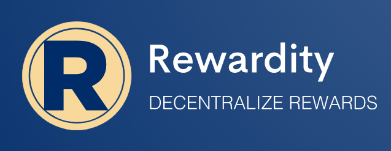

Showcase URL: TODO

##### Table of Contents
- [Description](#description)
    * [Problem](#problem)
    * [Solution](#solution)
- [Architecture and used dependencies](#architecture-and-used-dependencies)
    * [Current state](#current-state)
    * [Potential further improvements](#potential-further-improvements)

## Description
**Rewardity** is a set of **well tested** tools which can help you to set up, manage and monitor **web3 rewards** for your dApp or **adapt existing web2** project. Add collection points or loyalty bonuses to your product with ease!

### Problem
* Quite a lot of the **existing web2** applications (like Reddit for example) or **offline businesses** (like StarBucks) might have pretty standard reward or loyalty programs which they might like to **adapt for web3**. But effort for development might be quite high as well as expertise required.
* You might need to make a **new dApp** but **don't want to extra spend effort** adding "yet another reward system" yourself.

### Solution
**Rewardity** provides:
* a set of **well tested** (just check our tests + tested on **Polygon**) smart contracts to set up a simple reward/likes/loyalty/rating etc. system.
* A small and tiny backoffice UI to test and keep track of activity on your platform. Want to manually adjust reward of some user? We can help!

## Architecture and used dependencies
### Current state
* Smart contracts are covered with plenty of unit tests.
* Smart contracts deployed and tested on **Polygon**. Example contracts: https://mumbai.polygonscan.com/token/0xD898CD70Cd157D92693aD736df7DDef4373CE6CC and https://mumbai.polygonscan.com/address/0xB021c9Ada326Ed7e7B2a395bf5D06abca0302fC0
* A web backoffice application to test or adjust rewards.

### Potential further improvements
* Add unique rewards (in form NFTs for example).
* Improve smart contracts. Like allow users top up of their reward balances or sell/exchange it.
* Improve UI/UX and functionality of the backoffice.